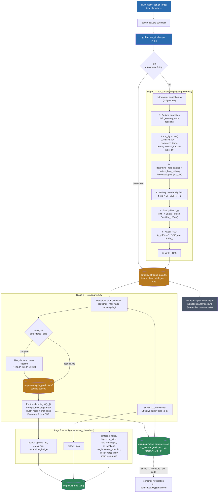

# HPC Pipeline

Batch-cluster workflow for the 21 cm × Euclid galaxy cross-correlation
lightcone simulation. `run_pipeline.py` drives the whole thing from one
command; the expensive simulation stage is still separable, so it only runs
once per parameter set while the cheap analysis re-runs freely.

## Flowchart



## Stages

| # | Stage | Where it runs | Input | Output |
|---|-------|----------------|-------|--------|
| 0 | `submit_job.sh` — shell launcher: activates `21cmfast`, times the run, forwards its arguments to `run_pipeline.py`, emails a report via `sendmail` | HPC login/compute node | CLI arguments | `outputs/<job>_<timestamp>.log` |
| 1 | `run_simulation.py` — 21cmFASTv4 lightcone, halo catalogue, galaxy field, bias estimate, Kaiser RSD. Invoked as a subprocess when `--sim` says so | HPC compute node (headless, `matplotlib.use("Agg")`) | Config block at top of script | `outputs/lightcone_data.h5` |
| 2 | `src/analysis.py` — cylindrical power spectra, then `compute_uncertainty_budget` (photo-$z$ damping, wedge excision, HERA noise, variance, SNR), Euclid selection, effective bias | Anywhere | `lightcone_data.h5` | `outputs/analysis_products.h5` |
| 3 | `src/figures.py` — all 11 figures, `Agg` backend | Anywhere | Loaded data + spectra | `outputs/figures/*.png` |
| 4 | `run_pipeline.py` summary | Anywhere | All of the above | `outputs/pipeline_summary.json` + console report |
| — | `notebooks/plot_fields.ipynb`, `notebooks/analysis.ipynb` | Local machine or interactive HPC Jupyter session | `lightcone_data.h5` | Inline figures (same content, interactive) |

Stages 2–4 never touch 21cmFAST — they only read the HDF5 file, so they are
fast to re-run after tweaking a plot.

## Why split like this

- **Cost isolation**: the 21cmFAST run is the only step that needs cluster
  CPU/wall-time; plotting and power-spectrum math are cheap and iterate
  quickly without resubmitting a job. `--sim auto` (the default) never
  re-runs it by accident.
- **Reproducibility**: all scalar parameters (grid, cosmology, survey cuts,
  RSD inputs) are stored as HDF5 attributes alongside the fields, so stages
  2–4 are fully self-contained given only the `.h5` file.
- **Headless-safe**: both `run_simulation.py` and `src/figures.py` force the
  `Agg` matplotlib backend, so the pipeline runs under SLURM with no display.
- **Two front-ends, one implementation**: the notebooks remain for interactive
  work, but the science code they used to inline now lives in `src/`, is
  tested, and is what the batch pipeline runs.

## Running it

```bash
# Everything, one command (simulation runs only if the HDF5 is missing)
python run_pipeline.py

# On the cluster, with timing + email notification
bash submit_job.sh --sim force        # force a fresh 21cmFAST run
bash submit_job.sh                    # analyse stored results and re-plot

# Useful variants
python run_pipeline.py --analysis force        # recompute the power spectra
python run_pipeline.py --plots power snr       # only the k-space figures
python run_pipeline.py --plots none            # numbers only, no figures
python run_pipeline.py --max-halos 5000000     # cap catalogue memory
python run_pipeline.py --format pdf --dpi 300  # publication-ready output
python run_pipeline.py --help                  # full option list

# Interactive exploration of the same results
jupyter notebook notebooks/plot_fields.ipynb
jupyter notebook notebooks/analysis.ipynb
```

### Stage control

| Flag | `auto` (default) | `force` | `skip` |
|------|------------------|---------|--------|
| `--sim` | run `run_simulation.py` only if `outputs/lightcone_data.h5` is missing | always re-run it | never run it; error if there is no stored output |
| `--analysis` | recompute the power spectra only if the cache is missing or older than the simulation | always recompute | load the cache; error if absent |

All commands must run inside the `21cmfast` conda environment
(`conda activate 21cmfast`, or `conda run -n 21cmfast <command>`).

> **`submit_job.sh` is not a SLURM script.** It contains no `#SBATCH`
> directives and runs in the foreground on whatever node invokes it — hence
> `bash`, not `sbatch`. To submit it as a true batch job, add the `#SBATCH`
> directives your cluster requires (`--partition`, `--time`, `--account`,
> `--cpus-per-task`, …) at the top of the script first.

## Outputs

### `outputs/lightcone_data.h5` (Stage 1)

| Dataset / attrs | Description |
|---|---|
| `brightness_temp_field`, `density_field`, `neutral_fraction`, `galaxy_overdensity` | `(HII_DIM, HII_DIM, N_z)` lightcone fields (gzip-compressed) |
| `lc_redshifts`, `lc_dist_Mpc` | Per-slice redshift and comoving distance |
| `halo_catalog/{halo_masses, halo_coords, stellar_masses, sfr}` | Per-halo catalogue at `z_obs` (SFR in M☉ yr⁻¹) |
| root attrs | Grid/box config, redshift range, galaxy bias, β_rsd, Euclid survey params, cosmology, HERA instrument params, wedge/binning settings |

### `outputs/analysis_products.h5` (Stage 2)

| Dataset / attrs | Description |
|---|---|
| `k_perp`, `k_parallel` | Log-spaced bin centres [Mpc⁻¹] |
| `P_21cm_auto`, `P_galaxy_auto`, `P_cross` | 2D cylindrical spectra on that grid |
| `mode_counts` | Fourier modes averaged per bin |
| `uncertainty_budget/` | Group: `photoz_kernel`, `P_cross_observed`, `P_galaxy_observed`, `outside_wedge`, `sigma_21cm`, `sigma_galaxy`, `cosmic_variance_term`, `noise_coupling_term`, `sigma_cross`, `snr_per_mode`; its attrs hold the 21 budget scalars |
| root attrs | `source_path`, `source_mtime` — used to detect a stale cache |

See [`docs/uncertainty_budget.md`](docs/uncertainty_budget.md) for the formulas
behind the `uncertainty_budget` group and the four CLI flags
(`--sigma-z`, `--wedge-buffer`, `--integration-time`, `--bandwidth`) that let
it be recomputed without re-running the simulation.

### `outputs/figures/` (Stage 3)

`lightcone_fields`, `lightcone_slice`, `halo_catalogue`, `sfr_relations`,
`uv_luminosity_function`, `stellar_mass_muv`, `main_sequence`,
`power_spectra_2d`, `cross_snr`, `uncertainty_budget`, `galaxy_bias`.

### `outputs/pipeline_summary.json` (Stage 4)

Simulation geometry, ⟨x_HI⟩, the large-scale cross-spectrum sign, photo-$z$
smearing σ_r, both wedge slopes, the fraction of modes outside the wedge,
noise levels, the total SNR, the Euclid selection counts, and ⟨b_g⟩.

See `README.md` for the full science background and equation references,
`docs/HPC.md` for the complete parameter-level specification of the run (every
configuration value, evaluated formula, output file, and known
inconsistency), and `docs/project_update.md` for the latest run's numerical
results.

> **Regenerate the stored HDF5 before trusting any numbers.** As of
> 2026-08-04 the galaxy-bias calculation is corrected: any
> `outputs/lightcone_data.h5` written earlier carries $b_g = 33.4$ (a
> ν-convention error) and $\beta_\mathrm{rsd} = 0.030$ instead of 4.74 and
> 0.210, so its `galaxy_overdensity` field has the wrong Kaiser boost. Run
> `bash submit_job.sh --sim force` — the default `--sim auto` will not re-run
> while the old file exists. See `docs/project_update.md` §4 and §11.

> **The redshift range is a deliberate smoke test.** `run_simulation.py` spans
> only `z_min = 6.995` → `z_max = 7.005` ($L_\mathrm{LOS} = 3.5$ Mpc,
> LOS oversampled $\sim 57\times$), giving a quasi-coeval slab. That matches
> the power-spectrum estimator, which assumes LOS homogeneity. Widening it to
> a true lightcone is gated on the estimator work in `TODO.md` §P0 — see the
> fiducial-parameter table in `README.md` §4.
