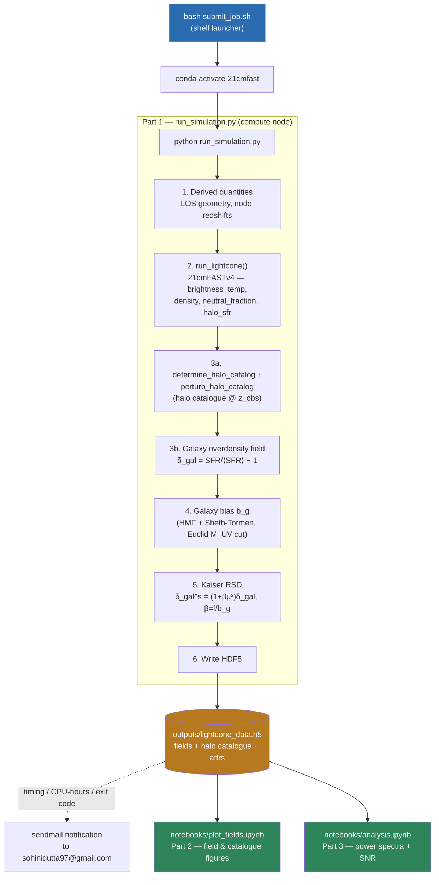

# HPC Pipeline

Batch-cluster workflow for the 21 cm × Euclid galaxy cross-correlation
lightcone simulation. Splits the expensive simulation (compute node, no
display) from the cheap, iterable analysis (interactive Jupyter session),
so the simulation only needs to run once per parameter set.

## Flowchart



## Stages

| # | Stage | Where it runs | Input | Output |
|---|-------|----------------|-------|--------|
| 1 | `submit_job.sh` — shell launcher: activates `21cmfast` conda env, times the run, emails a completion/failure report via `sendmail` | HPC login/compute node | — | `outputs/<job>_<timestamp>.log` |
| 2 | `run_simulation.py` — **Part 1**: 21cmFASTv4 lightcone, halo catalogue, galaxy field, bias estimate, Kaiser RSD | HPC compute node (headless, `matplotlib.use("Agg")`) | Config block at top of script | `outputs/lightcone_data.h5` |
| 3 | `notebooks/plot_fields.ipynb` — **Part 2**: diagnostic and literature-comparison figures | Local machine or interactive HPC Jupyter session | `lightcone_data.h5` | Inline figures |
| 4 | `notebooks/analysis.ipynb` — **Part 3**: 2D cylindrical power spectra, photo-z damping, foreground wedge excision, SNR | Local machine or interactive HPC Jupyter session | `lightcone_data.h5` | Inline figures + SNR summary |

Parts 2 and 3 never touch 21cmFAST or re-run the simulation — they only read
the HDF5 file, so they are fast to re-run after tweaking a plot.

## Why split like this

- **Cost isolation**: the 21cmFAST run is the only step that needs cluster
  CPU/wall-time; plotting and power-spectrum math are cheap and iterate
  quickly without resubmitting a job.
- **Reproducibility**: all scalar parameters (grid, cosmology, survey cuts,
  RSD inputs) are stored as HDF5 attributes alongside the fields, so Parts 2–3
  are fully self-contained given only the `.h5` file.
- **Headless-safe**: `run_simulation.py` forces the `Agg` matplotlib backend
  so it can run under SLURM with no display.

## Running it

```bash
# On the cluster
bash submit_job.sh                            # Part 1 — writes outputs/lightcone_data.h5
                                                # (emails sohinidutta97@gmail.com on completion/failure)

# Locally, or in an interactive HPC Jupyter session
jupyter notebook notebooks/plot_fields.ipynb   # Part 2 — field plots
jupyter notebook notebooks/analysis.ipynb      # Part 3 — power spectra & SNR
```

All commands must run inside the `21cmfast` conda environment
(`conda activate 21cmfast`, or `conda run -n 21cmfast <command>`).

> **`submit_job.sh` is not a SLURM script.** It contains no `#SBATCH`
> directives and runs in the foreground on whatever node invokes it — hence
> `bash`, not `sbatch`. To submit it as a true batch job, add the `#SBATCH`
> directives your cluster requires (`--partition`, `--time`, `--account`,
> `--cpus-per-task`, …) at the top of the script first.

## `outputs/lightcone_data.h5` contents

| Dataset / attrs | Description |
|---|---|
| `brightness_temp_field`, `density_field`, `neutral_fraction`, `galaxy_overdensity` | `(HII_DIM, HII_DIM, N_z)` lightcone fields (gzip-compressed) |
| `lc_redshifts`, `lc_dist_Mpc` | Per-slice redshift and comoving distance |
| `halo_catalog/{halo_masses, halo_coords, stellar_masses, sfr}` | Per-halo catalogue at `z_obs` |
| root attrs | Grid/box config, redshift range, galaxy bias, β_rsd, Euclid survey params, cosmology, HERA instrument params, wedge/binning settings |

See `README.md` for the full science background and equation references, and
`docs/project_update.md` for the latest run's numerical results.

> **Check the redshift range before running.** The committed configuration in
> `run_simulation.py` spans only `z_min = 6.995` → `z_max = 7.005`
> ($L_\mathrm{LOS} = 3.5$ Mpc), a fast smoke-test slab rather than a science
> lightcone. See the fiducial-parameter table in `README.md` §4.
